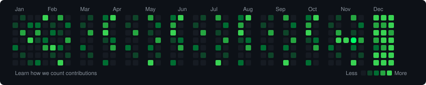

  <!-- Waving Header Banner -->
  

   

  <!-- Typing SVG Tagline -->
  

 

### About

  

---

### Skills

#### Data Analytics & BI

#### AI & Machine Learning

#### Cloud & DevOps

#### Database Administration (DBA)

---

### Stats

  <!-- GitHub Streak Stats -->
  

 

  <!-- Interactive Trophies -->
  

---

### Contribution

  <!-- Snake Game Contribution Graph -->
  

---

### Connect

